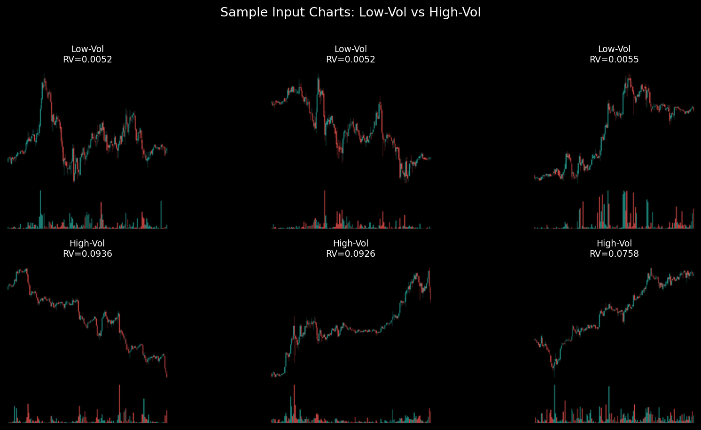
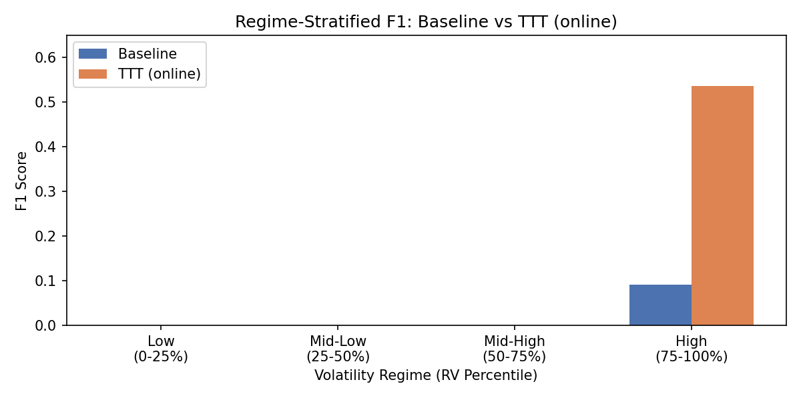

# Test-Time Training for Robust Crypto Volatility Regime Classification

**Pramesh Singhavi** · ECE 176, UC San Diego · March 2026

Re-implementation of [Test-Time Training (Sun et al., 2020)](https://arxiv.org/abs/1909.13231) applied to a novel domain: vision-based cryptocurrency volatility regime classification. Introduces two domain-specific extensions — temporal masking auxiliary task and entropy-adaptive confidence gate — that make TTT viable for non-stationary financial time series.

---

## Quick Start

```bash
# Install dependencies
pip install -r requirements.txt

# Launch interactive dashboard
streamlit run dashboard/app.py

# Run evaluation (baseline + TTT standard + TTT online)
python -m src.eval --checkpoint checkpoints/joint/best.pt \
  --ttt_steps 10 --ttt_lr 0.05 --ttt_optimizer adam \
  --entropy_adaptive --entropy_gate_threshold 0.3 --threshold 0.35
```

> If you see a PyTorch `torch.classes` warning with the dashboard, use:
> `STREAMLIT_SERVER_ENABLE_FILE_WATCHER=false streamlit run dashboard/app.py`

---

## Project Structure

```
crypto-ttt-regime/
├── src/
│   ├── models.py          # Y-shaped ResNet18-GN architecture
│   ├── ttt_learner.py     # TTT adaptation logic (standard + online)
│   ├── train.py           # Joint training CLI
│   ├── eval.py            # Evaluation CLI (baseline vs TTT modes)
│   ├── dataset.py         # OHLCV → candlestick chart pipeline
│   └── fetch_data.py      # Binance API data fetcher
├── experiments/
│   ├── 01_baseline_benchmark.ipynb   # Baseline + TTT (mask aux)
│   ├── 02_ttt_masked_patch.ipynb     # Rotation vs mask comparison
│   └── 03_regime_stress_test.ipynb   # Regime-stratified + ETH validation
├── dashboard/
│   └── app.py             # Streamlit interactive dashboard
├── checkpoints/
│   ├── joint/best.pt      # Mask aux, best val loss (epoch 1)
│   ├── rotation/best.pt   # Rotation aux (epoch 4)
│   └── joint_eth/best.pt  # ETH cross-asset (epoch 3)
└── data/
    ├── raw/               # Raw OHLCV parquet (Binance hourly)
    ├── processed/         # Processed BTC dataset tensors
    └── processed_eth/     # Processed ETH dataset tensors
```

---

## Problem

Cryptocurrency markets are highly non-stationary, with frequent regime shifts in volatility and participant behavior. Models trained on historical data often fail to generalize when the test environment differs from training.

**Research question:** Can self-supervised TTT adapt a vision-based volatility classifier to non-stationary crypto market regimes without access to ground-truth labels during inference?

**Hypothesis:** Market regimes correspond to domain shifts in chart geometry and volatility structure. Solving a temporally-aware self-supervised task on test samples can align the feature extractor to the active regime before prediction.



---

## Approach

- **Data:** Hourly OHLCV (BTCUSDT) → rolling 168h windows → candlestick + volume chart images (224×224). Binary labels from next-24h realised volatility (threshold from training set median, no look-ahead). Train/val/test split by time with 168h embargo.
- **Model:** Y-shaped ResNet18-GN: shared encoder (layers 1–3) → main head (classification) and aux head (self-supervised). GroupNorm throughout for single-sample TTT (BatchNorm fails with batch size 1).
- **Auxiliary tasks:** (1) **Rotation** (0°/90°/180°/270°) — baseline from Sun et al. (2020). (2) **Temporal masking** — mask random column slices; reconstruct with foreground-weighted MSE so gradients focus on chart pixels rather than black background.
- **Training:** Joint optimization of main (cross-entropy with class weights) + aux loss. Checkpoint by validation loss. Cosine annealing LR schedule.
- **Test time:** Adapt encoder with gradient steps on aux loss (no labels), then predict. Compared: **Baseline** (no adaptation), **TTT (standard)** (adapt per sample, reset encoder), **TTT (online)** (adapt sequentially, keep encoder).

**Novel extensions:**
1. **Temporal masking auxiliary task** — masks random vertical slices of chart images and reconstructs them, forcing the model to learn regime-dependent temporal structure. Foreground-weighted MSE ensures gradients are driven by candlestick geometry rather than black background pixels.
2. **Entropy-adaptive confidence gate** — scales TTT step size by prediction entropy and skips adaptation entirely when the model is already confident, preventing over-adaptation on easy samples.

---

## Results

### Experiment 01 — Baseline and TTT (Mask Auxiliary)

| Mode           | Accuracy | F1     | ECE    | Brier  | IC      |
|----------------|----------|--------|--------|--------|---------|
| Baseline       | 0.7636   | 0.0808 | 0.0585 | 0.1723 | 0.0951  |
| TTT (standard) | 0.5688   | 0.3054 | 0.1149 | 0.1850 | 0.0046  |
| TTT (online)   | 0.7065   | 0.1567 | 0.1104 | 0.1827 | -0.0677 |

The baseline achieves high accuracy by predicting the majority class (low-vol), yielding near-zero F1. Online TTT with the confidence gate maintains 0.71 accuracy while improving F1 to 0.16.

### Experiment 02 — Rotation vs Mask Auxiliary

| Aux task | Mode           | Accuracy | F1     | IC      |
|----------|----------------|----------|--------|---------|
| Mask     | Baseline       | 0.7636   | 0.0808 | 0.0951  |
| Mask     | TTT (standard) | 0.5688   | 0.3054 | 0.0046  |
| Mask     | TTT (online)   | 0.7065   | 0.1567 | -0.0677 |
| Rotation | Baseline       | 0.5013   | 0.3663 | 0.1913  |
| Rotation | TTT (standard) | 0.4987   | 0.3299 | 0.0147  |
| Rotation | TTT (online)   | 0.4026   | 0.3072 | -0.0587 |

Rotation TTT aux loss explodes (0.004 → 22.5) — rotating charts has no regime-specific semantics. Temporal masking is the only viable auxiliary task for financial TTT.

### Experiment 03 — Regime-Stratified Evaluation

| RV bin            | n   | Baseline acc | Baseline F1 | TTT acc | TTT F1  |
|-------------------|-----|--------------|-------------|---------|---------|
| low (0–25%)       | 193 | 0.969        | 0.000       | 0.549   | 0.000   |
| mid-low (25–50%)  | 192 | 0.938        | 0.000       | 0.641   | 0.000   |
| mid-high (50–75%) | 192 | 0.974        | 0.000       | 0.630   | 0.000   |
| **high (75–100%)**| 193 | 0.176        | 0.091       | **0.415** | **0.531** |

TTT improves F1 from 0.09 to 0.53 in the high-volatility regime where distribution shift is largest. The confidence gate preserves accuracy in low/mid-vol regimes.



### Experiment 04 — Cross-Asset Validation (ETHUSDT)

| Mode           | Accuracy | F1     | ECE    | Brier  | IC      |
|----------------|----------|--------|--------|--------|---------|
| Baseline       | 0.4675   | 0.3750 | 0.0979 | 0.1993 | 0.0667  |
| TTT (standard) | 0.5961   | 0.2613 | 0.0852 | 0.1975 | -0.0167 |
| TTT (online)   | **0.7026** | 0.2776 | **0.0688** | 0.1932 | 0.0629 |

Online TTT improves accuracy 0.47 → 0.70 and calibration ECE 0.098 → 0.069 on ETH with no retraining, demonstrating cross-asset generalization.

---

## Reproducibility

**Run order:**
```bash
# 1. Fetch data (requires Binance API)
python -m src.fetch_data

# 2. Train (mask auxiliary)
python -m src.train --parquet data/raw/btcusdt_1h.parquet \
  --train_end 2022-12-31 --val_end 2023-12-31 \
  --epochs 30 --aux_task mask --lambda_aux 1.0

# 3. Evaluate
python -m src.eval --checkpoint checkpoints/joint/best.pt \
  --ttt_steps 10 --ttt_lr 0.05 --entropy_adaptive \
  --entropy_gate_threshold 0.3 --threshold 0.35

# 4. Run experiments in order
# experiments/01_baseline_benchmark.ipynb
# experiments/02_ttt_masked_patch.ipynb
# experiments/03_regime_stress_test.ipynb
```

**Key hyperparameters:** TTT lr=0.05, steps=10, Adam optimizer, entropy gate threshold=0.3, mask ratio=0.2, decision threshold=0.35

**Hardware:** UCSD DataHub with CUDA GPU

---

## References

Sun, Y., Wang, X., Liu, Z., Miller, J., Efros, A. A., & Hardt, M. (2020). Test-Time Training with Self-Supervision for Generalization under Distribution Shifts. *ICML 2020*.
